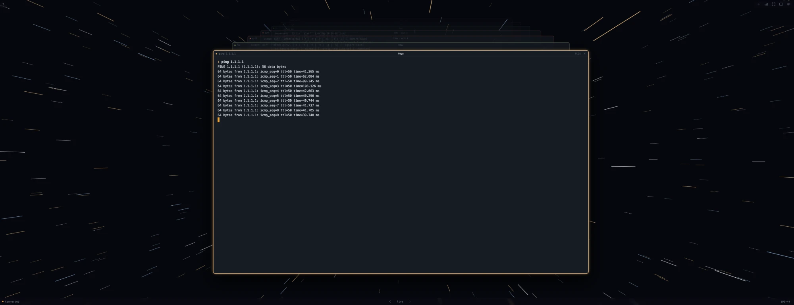
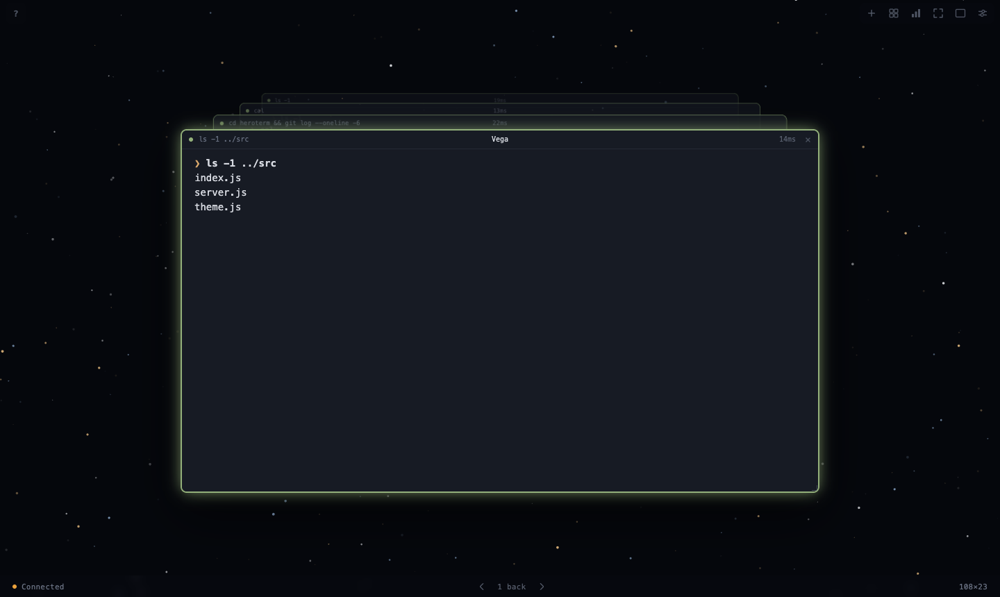

# HeroTerm

**A terminal where every command gets its own window.**

Your real shell — zsh, your dotfiles, your prompt, your aliases, unchanged —
rendered in a browser tab. The difference isn't the pixels. It's that the shell
*tells the interface what it's doing*, so the interface can be organised by
command instead of being one endless scroll buffer.

Run something and it opens a clean window. The command before it slides back
into the screen behind, Time Machine style, and you can walk back through the
last dozen — each replayed from the original bytes, colours and cursor moves
intact. The window border is yellow while it runs, green or red when it's
done. Refresh the page and none of it is lost.



<!-- Two more to come — see docs/README.md for what each should show.
<p align="center">
  
  
</p>
-->

## What's actually new here

Browser terminals exist — ttyd, Wetty, and others. They give you the same
scroll buffer somewhere else. This one asks the shell to mark where each
command begins and ends, using the OSC 133 "semantic prompt" sequences that
iTerm2 and VS Code use, and then builds the interface around those boundaries:

- **A window per command**, with its exit status in the border and a deck of
  the last twelve behind it.
- **Boundaries that survive an ssh hop.** The markers only describe the local
  shell, so bracketed-paste transitions are used as a second signal — commands
  you run on a remote host get their own windows with nothing installed there.
- **A session that outlives the socket.** The pty lives on the server, so a
  refresh reattaches to the same shell with its cwd, its environment and
  whatever was still running.
- **Several terminals**, each its own shell, tiled by dragging one onto
  another's edge.
- And a star field behind it all that flies from whatever is working — which
  is either the best or the worst idea in here, depending on your taste.

## Is this safe?

It runs a shell, so the question is a fair one. The short version:

- The server binds `127.0.0.1` only, never `0.0.0.0`.
- Every launch mints a random 192-bit token, held in memory and printed once.
  Without it the socket returns 403.
- That token matters more than it looks: **localhost WebSockets aren't
  protected by CORS**, so without it any page you happened to visit could open
  a socket to your shell. Loopback is not an access boundary — every process
  and every user on the machine can reach that port.
- Everything else the server hands out is gated on the same token: your shell
  history for the stats page (counted server-side, only the aggregate sent),
  the list of installed fonts, and the configuration it's running with.

Longer version, including what it deliberately does *not* protect against, in
[Security](#security) below.

## What works where

| | |
|---|---|
| macOS + zsh | everything |
| Linux + zsh | should be fine, untested |
| bash / fish | runs, with reduced features — no exit codes, no command names on the cards |
| Windows | no |

The shell integration is zsh-only today. Other shells fall back to
bracketed-paste detection, which knows when a command started and stopped but
not what it was or how it went.

## Run it

You need Xcode's command line tools first, because `node-pty` compiles a native
addon:

```bash
xcode-select --install
```

Then:

```bash
npm install
npm start
```

That prints a URL with a token. Open it. The token is regenerated every launch
and is what stops other pages in your browser from opening a socket to your
shell — localhost WebSockets aren't protected by CORS.

Because the token changes every launch, the URL you have bookmarked stops
working when you restart the server. Copy the new one it prints.

**Editing `server.js` needs a restart.** Everything under `public/` is read off
disk on every request, so a reload picks it up — but `server.js` is read once,
when the process starts. Leave a server running across an edit and you get a
new browser talking to an old server, which fails in ways that look like
anything but that. The socket handshake carries a protocol number for exactly
this reason: when they disagree, the status line says so instead of letting you
guess.

## How it fits together

```
browser                          node                    macOS
┌──────────────┐   websocket   ┌──────────┐   pty fd   ┌────────┐
│  xterm.js    │ ────────────► │ server.js│ ─────────► │  zsh   │
│  (a grid of  │ ◄──────────── │ node-pty │ ◄───────── │        │
│   ANSI cells)│    output      └──────────┘            └────────┘
└──────────────┘
```

`node-pty` opens a pseudoterminal — the same kind of device iTerm opens — and
hands one end to zsh. Your shell can't tell the difference. xterm.js parses the
ANSI escape sequences coming back and paints them.

Beyond the terminal itself the server hands out three things, all behind the
same token: your shell history counted up for the stats sheet (`/stats`, see
"What you actually type"), the installed fonts for the font picker (`/fonts`),
and the limits it's running with for the System tab (`/config`).

## Make it yours

The defaults for everything visual are in `public/theme.js`: the typeface, size,
line height, the sixteen ANSI colors, the cursor, the star field. Everything
audible is in `public/audio.js`. Edit and reload. Settings changes the theme,
font, text sizes and the rest on top of those, for this browser.

Any installed font can be picked from settings. For a Powerlevel10k or
Starship prompt you need a Nerd Font **installed on the machine**, not just
named in the theme — the browser can only use what the system has:

```bash
brew install --cask font-meslo-lg-nerd-font
```

Then run `p10k configure` once while inside HeroTerm so the prompt is measured
against this renderer.

Anything in `public/index.html` is yours too. The grid is one element, so you
can put whatever you want around it — a git status rail, a clock, a second
terminal, an ambient background behind a translucent grid.

## The window

`?` in the top-left corner opens a short help pop-up — the buttons, the keys,
and the two things that surprise people. Escape or a click outside closes it.
Its text lives in the markup in `public/index.html`, so editing it is editing
the page.

Six buttons, top-right corner of the page. They belong to the page rather
than to any window, so they stay put whatever the deck is doing:

| | |
|---|---|
| plus | another terminal, in a container of its own |
| grid | arrange every window to fill the screen, all about the same size |
| bars | what you actually type — see below |
| sliders | settings |
| expand | the browser's own full screen — the whole display, tab strip gone |
| square | pop the deck out of the tab into a floating window, and back |

The window you're working in breathes: its glow swells and settles on a slow
cycle, in whatever colour its last command left behind — grey when nothing has
run, yellow while something is, green or red once it's done. The others fade to
a fifth of their opacity and the star field shows through them, so there is
never a question which one your keys are going to. How faded is in Settings →
Appearance, as a slider and a number box that drive each other; while you're
adjusting it, the window beside the sheet shows itself faded that much. Reset
puts it back to the default. It's kept in this browser, not on the server, and
`public/theme.js` holds the defaults: `dimmed` for the fade and `breath` for
the length of one breath. The breathing stops under `prefers-reduced-motion`.

The browser tab is titled after the window you're in — `npm test | HeroTerm` —
following whichever card it's showing, so walking back through the deck
changes it too. A window that hasn't run anything yet leaves just `HeroTerm`.

Each window is named when it's made — stars, given what's behind them — and the
name sits in the middle of its title bar. Double-click it to rename; Enter or
clicking away keeps it, Escape puts it back. Names are remembered with the rest
of the layout. The list is `NAMES` in `public/app.js`, and once it runs out the
windows are numbered.

The `+` gives you another container: its own shell, its own deck, its own
position, up to eight of them. Click one to bring it forward — that's the one
keys go to — and close it with the `×` in its title bar, or by exiting its
shell; close the last one and a fresh one takes its place. More than one only
makes sense floating, so adding a second switches to windowed and the fill-the-
tab button greys out until you're back to one.

Each container's shell is independent, and each is reattached separately after
a refresh, so three terminals in three directories come back as three terminals
in three directories.

The windows themselves are the cards in the deck. Drag the front one by its
title bar and the whole stack comes with it; the ones behind take no pointer
events at all, which is what makes the top one the only one you can pick up.
Resize from any edge or corner — dragging the top or left edge moves that edge
and leaves the opposite one where it is, and the minimum size stops the edge
you're holding rather than walking the window across the screen.

Drop a window against the inside edge of another one and they split its space
between them, the way iTerm divides a pane: whichever of that window's edges
you are nearest decides who takes which half. The middle of a window means
nothing, so you can drag across one without disturbing it, and a split that
would leave either window under the minimum size is refused rather than
attempted. Two outlines show it before you let go — solid for the window you're
holding, dashed for where the other one ends up — and they draw over the
windows rather than under them, since the one you are aiming at is usually the
one underneath. The window in your hand goes above all of it for as long as you
hold it: above the other windows, above the outlines, and above the status bar
and the controls. The whole stacking order is written down in one place, at the
top of `public/app.js`, because the numbers only make sense together.

Drag a window against a *screen* edge and it snaps instead: a side for a half,
a corner for a quarter, the top to fill. The screen wins over a split, so the
outer 26px of the display is always a deliberate aim even when a window happens
to be flush against it. An outline shows where it will land before you
let go, and dragging it back off an edge hands its old size back rather than
leaving you towing a half-screen slab. On a free drag the edges are magnetic —
they line up with the screen's sides and middle and with every other window,
within a few pixels.

Snapping works in the coordinates of the window you can see, not the deck box
that holds it: a deck is taller than its window by the band the older commands
cascade into, so a window snapped to the top of the screen puts its title bar
there rather than 36px of empty air.

Where you put it is remembered, including which mode you were in. The two size buttons are independent, so a floating
deck on a full-screen star field is available if you want it.

The status line along the bottom — connection, deck position, grid size — is
page furniture too.

Full screen is driven by the `fullscreenchange` event rather than the promise
`requestFullscreen()` returns, because pressing Esc to leave only produces the
event — and because there are embedded browsers that accept the call and then
never settle the promise at all. If the browser won't do it, the button retires
itself rather than sitting there looking live.

Behind it is a sky. Sitting still it's a field of stars that breathe; while a
command runs it's the view out of the front of something going much too fast.
One star array serves both — each star has a depth, drawn in perspective, and
the only difference is whether that depth is falling. The speed is eased rather
than switched, which is what gives you the lurch into hyperspace instead of an
abrupt cut.

It flies from whatever is working: the centre of the window running a command,
or the mean of their centres when several are. Start a second command and the
vanishing point slides to sit between them; let one finish and it slides to the
one still going. Moving or resizing a busy window takes the sky with it, since
the origin is asked for once a frame rather than set when a command starts.

Moving the vanishing point would drag the whole sky sideways with it, so every
star is shifted back by the same amount as the origin moves — they stay where
they are, and only the direction they stream changes. Stars that leave the
screen are respawned rather than merely skipped, because once the origin is off
to one side the far edge would otherwise empty out.

Every window carries its own verdict in its border, so a glance down the deck
tells you which of the last dozen commands went wrong:

| | |
|---|---|
| yellow | a command is running |
| green | it finished cleanly |
| red | it exited non-zero |

The front window gets the glow as well. The verdict stays with its window
forever, so you can look over long after the fact and still see how it went.

None of this is painted in full screen, where the terminal covers every pixel
of it — the animation loop stops rather than running behind an opaque window.
The one exception is turning Flying stars on in settings, which borrows the sky
for two seconds so you can see what you turned on. Star count and colours are
in `public/theme.js`.

### Arranging

The grid button tiles every window across the screen, below the strip the
page's own buttons live in, at about the same size. The grid isn't fixed: for
each possible number of rows the windows are dealt out as evenly as the rows
allow, and it keeps the layout whose windows are closest to a comfortable
terminal shape and closest to one another in size — four become two by two,
five become three over two, and nothing is left empty. Windows keep their
reading order, so each moves as little as it can, with 8px between them and
along the edges, and like a snap each remembers the size it had, for dragging
back out. Full-tab mode already is one window filling everything, so the
button is off there.

Pressing it again puts every window back where it was — as long as nothing
has changed in between. The button stays lit while that's true; move or
resize a window, open or close one, and it goes dark and the next press
arranges afresh instead. The undo survives a reload.

## Settings

The sliders button opens a sheet for the things that are taste rather than
correctness: the theme, the font, the terminal and interface text sizes, how far
unfocused windows fade, whether the stars fly, and whether any of it makes a
sound. Beside the window it's previewing, it shares that window's top and
bottom edges (never shorter than 420px — a shorter window is shown taller to
match, and gets its real size back on close); with no room for a preview it
runs the full height of the screen. It has four tabs — **Appearance**,
**Sound**, **Effects** and **System** — and opens on whichever you used last.
Theme and font each open a page of their own from Appearance, with a back
arrow in place of the tabs; Escape steps back one level at a time.

System is read-only: the limits HeroTerm is running with — shell, grace
period, commands and bytes kept per window and across a refresh, scrollback,
flow control, which history file the stats read — each with where it's set.
The server's come from `/config` (token-gated like the rest), so they're the
values after any environment overrides; the page's are read from the modules
that own them, not copied. When the server predates `/config`, the tab says so
and lists only the page's own values.

The two text sizes are separate on purpose. **Terminal text size** (px) is the
grid in every window, replayed cards included; ⌘+ and ⌘− still size one window
for a while, and ⌘0 returns to the setting rather than to 14. **Interface text
size** is five steps — 80, 90, 100, 115 and 135% — each button labelled with a
sample at the size it gives you. It covers everything else with words on it:
every UI font size in `public/index.html` is written as a multiple of
`--ui-scale`, so they move together while spacing and window geometry stay put.

While the sheet is open, the window you were working in moves to its left,
above the dimmed background, so every change lands on something you can see.
It keeps its size where that fits and shrinks only where it doesn't. Closing
settings puts it back exactly where it was — its real position is never
touched in between, so a refresh with the sheet open loses nothing either.
While you're adjusting the unfocused-window opacity, the dimming lifts and that
window wears the opacity you're choosing, since a focused window is otherwise
always solid; letting go of the slider puts both back.

Six themes ship — **Deep Field** (blue-grey), **Ember** (coal and firelight),
**Fathom** (deep water), **Amethyst** (violet), **Moss** (forest), and
**Vellum**, a paper light theme where the stars become ink and settle as dust.
Switching takes effect immediately, across the terminals, the replayed cards
behind them, the window chrome and the sky.

A theme is *only colour*. Type, spacing and the timings are shared, so
switching can never hand you a font you didn't ask for — and adding one is a
palette in `public/theme.js`, with the picker building itself from the
registry.

The font page lists what's installed on this machine, each name set in its
own face. A page can't enumerate installed fonts by itself, and even the
permission-gated API Chromium offers won't say which are monospaced — the one
thing a terminal cares about — so the server reads the font files directly
(`fonts.js`): the name table for the family, and the metrics for the spacing.
Monospaced fonts are listed by default; proportional ones are a checkbox away,
for the adventurous. The one you pick goes in *front* of the default stack
rather than replacing it, so glyphs it lacks — the icons in a Nerd Font prompt,
say — still come from the default.

A font being installed doesn't mean the browser will draw it, so the page
checks each one itself and lists only the ones it can reach, with a line saying
how many it left out. Brave is the usual culprit: its fingerprinting protection
hides every font it didn't ship with. Allowing fingerprinting for `localhost`
in Shields brings them back.

Two things make live switching work. `window.HEROTERM_THEME` is mutated in place
rather than replaced, because every module holds a reference to it and
reassigning the global would leave them all pointing at the old one. And
anything that can't simply read it again — terminals already built, stars
already coloured — subscribes to `HEROTERM_THEMES.on()` and is told.

The terminal text size and the window fade each have a slider and a number box
wired to the same value, each updating the other, since neither is the right
control on its own: one is for finding a number by eye, the other for saying
exactly which number you meant.

Whichever you are using is left alone while you use it. Writing a clamped value
back into the box you are typing in moves the caret out from under you, and
makes `10` impossible to type on the way to `100`.

Defaults live in `public/theme.js` and settings only record where you have
moved away from them, so `Reset` is a delete rather than a second copy of the
default. Sound is the exception: `public/audio.js` owns whether it is muted,
and which sounds are on, and the switches drive that rather than keeping a
second copy — two stores for one fact is how they come to disagree.

Turning the flying stars off leaves the sky where it is, still breathing.
Turning them on flies them for two seconds — the dimming behind the sheet
lifts, and in full-tab mode the sky is borrowed for the moment — so you see
what you've just turned on.
Whether something is running and whether you want to watch the sky move about
it are separate questions, both remembered, so switching the flying back on
part way through a command starts it flying rather than waiting for the next
one.

## Refreshing

Reload the page and nothing is lost: the same shell, the same screen, the same
deck, your cwd, your exported variables, whatever was still running.

That can't be done in the browser alone. A refresh closes the socket in exactly
the way closing the tab does, and if the server killed the pty there, you'd come
back to old cards bolted onto a brand-new shell — no cwd, no environment, no
running job. So the session lives on the server and outlives the socket:

- The pty keeps running, with a grace period once nobody is attached —
  ten minutes by default, `HEROTERM_GRACE` in seconds, `0` for the old
  kill-on-disconnect behaviour.
- The server parses the same OSC 133 markers the browser does, which splits the
  stream into per-command records, and keeps the last 12 of them plus the
  current screen — and, separately, the last window title and whether a
  full-screen program is up, since in a long session the sequences that set
  those scroll off the front of the kept screen. On reconnect it sends all of
  that back and the deck is rebuilt.
- Closing a container with its `×` ends that shell immediately. Closing the
  *tab* doesn't: `pagehide` and `beforeunload` fire on a refresh exactly as
  they do on a close and the browser won't tell you which is which, so ending
  the shells there would kill the thing reattaching exists to preserve. A tab
  that goes away is left to the grace period.
- A shell that ends by itself — `exit`, Ctrl-D, or killed from outside — takes
  its window with it, the way a terminal tab closes when its shell does. If
  that happens while the tab is away, the server remembers, and the window
  closes when you come back rather than quietly getting a new shell. A shell
  the grace period reaped is different: that wasn't your doing, so its window
  comes back with a fresh one.
- Close the last window — with its `×`, or by exiting its shell — and a fresh
  one opens in its place. A tab can't close itself, and an empty page is
  nothing you'd want.

Terminal output travels as WebSocket **text** frames and anything structural as
**binary** ones, which is how the browser tells them apart without having to
frame every byte of ordinary output.

Restored events carry a `restored` flag, so a command that was already running
before you refreshed picks its ticking back up without dinging at you, and the
deck doesn't open a second card for it.

The grace period is per-process: restart the server and the shell goes with it.

## What you actually type

The bar-chart button opens a sheet over everything: your most-used programs,
the lines you repeat most, and when in the day you work. Escape closes it, as
does clicking off the sheet.

It reads your **shell history file**, not this session, so it knows about every
terminal you have ever had open. `$HISTFILE` if that's set, otherwise
`~/.zsh_history`, `~/.zhistory` or `~/.bash_history`, whichever turns up first;
`HEROTERM_HISTFILE` overrides all of it. Both zsh's `EXTENDED_HISTORY` format
and bash's `HISTTIMEFORMAT` stamps are understood, including commands continued
across lines.

The program counted is the one you meant rather than the first word, so `sudo`,
a leading `VAR=value`, an absolute path and a leading `\` are all stepped over,
and only the head of a pipeline counts.

**This is the most sensitive thing the server exposes** — that file holds
everything you have ever typed at a prompt, tokens and all. So `/stats` is
gated on the same per-launch token as the socket, it's never cached, and the
counting happens in `history.js` on the server: what crosses to the browser is
already just numbers, apart from the handful of most-repeated lines, which are
the point of the exercise.

## The deck

Every command gets a window of its own. The live terminal is wiped when a new
one starts, so what you're looking at is that command and nothing else; the one
before it slides back into the screen behind, Time Machine style. `‹` and `›`
at the bottom of the page walk the deck, or `Cmd [` and `Cmd ]`. Running
anything brings you back to the present.

Each window opens with the command that made it — `❯ ls -G /usr`, then the
output. The card is also labelled with it, along with how long it took and its
exit status: in the dot beside the label, and in the window border.

That opening line is printed by the preexec hook rather than written by the
browser, which matters more than it sounds. xterm parses on its own schedule,
so a line written from the start marker's handler can land *after* output that
arrived in the same chunk. Sent down the wire in its proper place, it can't. It
also means the replayed cards get it for free, since it's simply part of what
the command produced. Its colours are the plain ANSI 16, so `public/theme.js`
still controls them.

There is only one pty and one live terminal, so the cards behind can't be live
views of anything. What's kept is the raw bytes each command produced, written
into a terminal of their own the first time you walk back far enough to see it.
Replaying the real bytes through the real renderer means colour, cursor moves
and overwrites all come out exactly as they did the first time, which no amount
of scraping the text off the screen would give you. It also means the cost is
bounded: 12 commands of history, 256 KB of output each in the page (the server
keeps the last 128 KB of each for a refresh), and no terminal built for a card
you never look at. Settings → System lists these limits and where they're set.

Boundaries are cut against the OSC 133 markers rather than against whatever the
pty happened to hand over in one read — `term.write()` parses on its own
schedule, so the bytes arrive before the markers inside them fire, and cutting
on chunk edges would make a card's extent depend on kernel buffering.

The command text on each card comes from `OSC 633;E`, which the preexec hook
sends. Over ssh there are no hooks to send it, so those cards are labelled
`command` — they still capture and replay correctly, they just can't be named.

**This costs you scrollback.** Clearing the live terminal for each command is
what makes the window clean, and it means you can't scroll up past the start of
the command you're running. What you'd have scrolled back to is the card behind
you. If that's the wrong trade, `live.clear()` in `public/stack.js` is the line.

## Sound

A ding when a command starts, a tick-tock while it runs, and a chime when it
finishes — a falling two-note one if it exited non-zero, so you can tell a
finished build from a broken one without looking. Settings → Sound has a master
switch and one for each sound — command starts, while it runs, finished,
failed, terminal bell — and turning one on plays it, so you know which is
which. The list comes from `public/audio.js`, so a sound added there shows up
in it without any markup. Choices are remembered.

Commands shorter than 300ms never tick; otherwise every `ls` would rattle.

The terminal bell gets a sound too: a short, low knock whenever anything writes
BEL — zsh when a completion has nothing to offer, vim on a bad motion, a script
that echoes `\a`. It's deliberately unlike the failure phrase: one is a
complaint about a keystroke, the other a verdict on a command. If you never
hear it, check for `setopt NO_BEEP` in your `.zshrc`.

The sounds are synthesised in `public/audio.js`, not sampled, so there are no
asset files. Pitches, envelopes and the tick interval are all constants at the
top of the functions that use them.

Working out *when* a command starts and stops is `public/session.js`, which is
also what drives the border and the star field — so muting the sound never
takes the visuals down with it.

The browser only receives a byte stream, so it can't tell a shell waiting at a
prompt from one running a build. The shell has to say so. `shell/zdotdir/`
stands in as `ZDOTDIR` for the session, sources your real files, and then
installs two hooks that emit OSC 133 — the same "semantic prompt" sequences
iTerm2 uses:

```
ESC ] 133 ; C BEL            a command is about to run
ESC ] 133 ; D ; <code> BEL   it finished, with this exit status
```

Your `ZDOTDIR` is handed straight back before your `.zshrc` is sourced, so
nothing that reads it sees the shim.

### Inside ssh, vim, and other things that sit there

Those markers only describe the *local* shell, which is a problem the moment
you run something that doesn't return for an hour. `ssh` emits "started" when
you connect and "finished" when you log out, so on the marker's account you are
running one very long command — and the tick-tock would keep going the whole
session.

So the UI watches a second signal that works on any host: bracketed paste.
Every modern line editor sends `ESC[?2004h` when it's ready for input and
`ESC[?2004l` when it hands a line off to run, and inside ssh those come back
down the same stream from the remote shell. Ticking stops the moment anything
— here or three hops away — starts waiting for you, and commands you run on the
far end get their own ding, ticking and chime with nothing installed over there.

What that can't carry is the exit status, so remote commands always finish with
the success chime. `shell/heroterm-remote.sh` fixes that if you want it: append
it to the remote `~/.zshrc` or `~/.bashrc` and real exit codes come back too.

Full-screen programs are handled separately — entering the alternate screen
(vim, less, top, tmux) stops the ticking on its own.

Two consequences worth knowing. An empty Enter and a remote command that
finishes in under 120ms look identical over bracketed paste, so both are
silent. And a REPL that uses readline — python, irb, node — marks every
statement you run as its own command, because as far as the wire is concerned
that is exactly what it is.

Only zsh is wired up for markers. Under bash or fish you still get sound, just
driven entirely by bracketed paste, which means no exit codes and so no failure
chime.

### Coding agents

Claude Code is one long command as far as the shell knows, and it's
full-screen with bracketed paste on, so by both rules above it's a program
waiting for you — no stars, no ticking, a window stuck on yellow for as long as
it's open. But its turns are exactly the thing you'd want the sky for.

So HeroTerm reads one more signal: the window title. Claude Code titles itself
`✳ <task>` while it waits and leads with a spinner, `◐` / `◑`, while it works.
Once a program has announced itself with `✳`, each turn is treated as a command
of its own: a ding when it starts, the stars and the ticking while it works,
the chime and a green border when it's done, and the window's clock timing the
turn. Waiting for your first prompt, the border is grey. The window itself
doesn't change — a full-screen program's output can't be cut into cards — and
when Claude Code exits, it finishes like any other command.

Nothing needs installing, in Claude Code or anywhere else. It does have a proper
signal for this — the OSC 9;4 progress sequence — but only sends it to Ghostty,
iTerm2 and ConEmu, chosen by `TERM_PROGRAM`, and pretending to be one of those
would change what every other program assumes this terminal can do. The title
is a UI detail rather than a contract, so if a future version changes its
spinner, this is the place to look: `AGENT_IDLE` and `AGENT_BUSY` at the top of
`public/session.js`.

After a refresh the state comes back as it was — mid-turn, the stars pick up
again without a ding; idle, they stay still — though a restored turn's clock
starts blank, since the server doesn't know when it began.

## Keys

| | |
|---|---|
| `Cmd C` / `Cmd V` | copy selection, paste |
| `Cmd T` | another terminal |
| `Cmd [` / `Cmd ]` | older / newer command in the deck |
| `Cmd K` | clear |
| `Cmd +` / `Cmd -` / `Cmd 0` | this window's text size; `0` returns to the size in settings |
| `Option F` / `Option B` | move by word |

## Security

Everything above about the token, plus what it doesn't cover:

- The token lives in the URL, which is the leakiest place for a secret —
  browser history, anything that logs URLs, and a shell history if you `open`
  it from a terminal. Redirecting the server's stdout to a file stores a live
  one.
- It defends against *other web pages*. It does not defend against code already
  running as your user, and nothing in this design could.
- Since the session persists, a leaked token doesn't get a fresh shell — it
  reattaches to yours, with your cwd and your running jobs.
- The comparison is `===`, not constant-time. Against a 192-bit random token
  over loopback that isn't a practical attack, but it is a free habit and
  `crypto.timingSafeEqual` would be the right call in anything shared.
- `ws://`, not `wss://`. Irrelevant on loopback; it matters the moment you
  tunnel it, which is why the README says `ssh -L` rather than binding
  `0.0.0.0`.

Found something worse? Open an issue, or mail the address on the GitHub
profile if you'd rather not do it in public.

## Worth knowing

**The shell outlives the tab by ten minutes.** See "Refreshing" — set
`HEROTERM_GRACE=0` if you'd rather it died with the socket, the way it used to.
For a session that survives the *server* too, run `tmux` as the first thing
inside it; you can then reattach the same session from iTerm.

**Browser search doesn't work** on the grid, since it's drawn to a canvas. Add
`@xterm/addon-search` if you want `Cmd F` back.

**Shell mouse mode works** — vim, less, and tmux panes all respond to clicks
once the program asks for mouse reporting.

**No inline images.** iTerm's `imgcat` protocol isn't implemented here. Sixel is
available through `@xterm/addon-image` if you need pictures in the terminal.

**Keep it on loopback.** The server binds `127.0.0.1` on purpose. Exposing this
on a network is handing out a root-capable shell over plaintext HTTP. If you
want it from another machine, tunnel it: `ssh -L 7777:localhost:7777 you@mac`.

## License

MIT. See [LICENSE](LICENSE).
